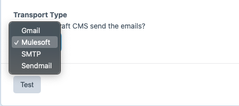
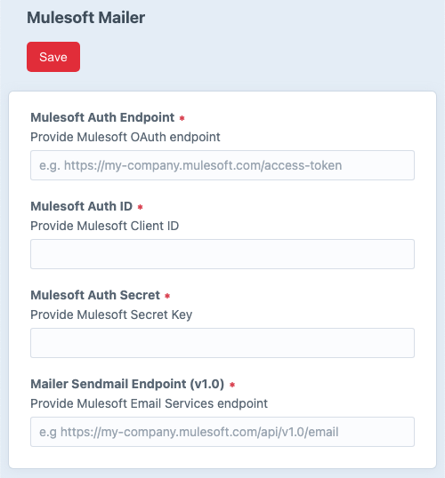

Mulesoft Mailer
===

Mulesoft mailer adapter/transport for Craft 3

### Installation

```bash
composer require leowebguy/mulesoftmail
```

On your Control Panel, go to Settings → Plugins → "Mulesoft Mail" → Install

...

### Usage

Go to Settings > Email > Select `Mulesoft` as transport type



Go to Settings > Mulesoft Mailer > Provide required settings



Save it!
